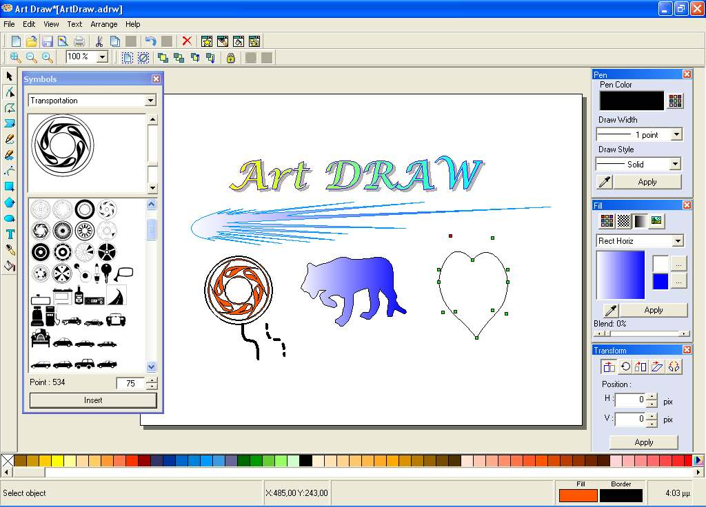

## ArtDraw \- Vector Graphics Software v1\.0\.1

### Description

ArtDraw is a vector drawing software with multiple functions (similar to CorelDraw).

You can Draw Polyline, FreePolygon, Curve (with bezier), Polygon, FreeLine, Free Line Closed, Rectangle, Ellipse and Text.

You can edit position, size, rotation, skew and mirror with 2 different mode and move points position.

Fill object with 4 different mode with transparency.

Insert and edit whatever symbol(fonts).

You can also objects, lock/unlock, zoom-it, save to file, copy-paste, undo-redo, export to raster format (bmp,gif,tif,png,jpg)

This program run only Win2000,XP,Vista

----

BUG FIX (26/3/2008):

FreePolygon,Polyline,Polygon,Ellipse in copy,paste and undo also with left mouse click the "Make Curve"

----

 
### More Info
 

             |
---                |---
**Submitted On**   |2008-03-20 17:12:22
**By**             |[Diomidisk](https://github.com/Planet-Source-Code/PSCIndex/blob/master/ByAuthor/diomidisk.md)
**Level**          |Advanced
**User Rating**    |5.0 (40 globes from 8 users)
**Compatibility**  |VB 6\.0
**Category**       |[Graphics](https://github.com/Planet-Source-Code/PSCIndex/blob/master/ByCategory/graphics__1-46.md)
**World**          |[Visual Basic](https://github.com/Planet-Source-Code/PSCIndex/blob/master/ByWorld/visual-basic.md)
**Archive File**   |[ArtDraw\_\-\_2107433262008\.zip](https://github.com/Planet-Source-Code/diomidisk-artdraw-vector-graphics-software-v1-0-1__1-70221/archive/master.zip)

